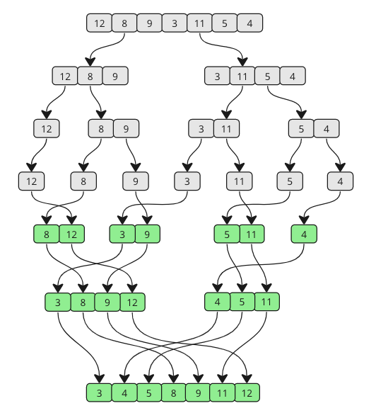

**How it works**:

    1. Divide the unsorted array into two sub-arrays, half the size of the original.
    2. Continue to divide the sub-arrays as long as the current piece of the array has more than one element.
    3. Merge two sub-arrays together by always putting the lowest value first.
    4. Keep merging until there are no sub-arrays left.

**Example image for merge sort** : 

**Manual Run**:

*Step 1*: We start with an unsorted array, and we know that it splits in half until the sub-arrays only consist of one element. The Merge Sort function calls itself two times, once for each half of the array. That means that the first sub-array will split into the smallest pieces first. 
&nbsp;&nbsp;&nbsp;&nbsp;`[ 12, 8, 9, 3, 11, 5, 4]`  
&nbsp;&nbsp;&nbsp;&nbsp;`[ 12, 8, 9] [ 3, 11, 5, 4]`  
&nbsp;&nbsp;&nbsp;&nbsp;`[ 12] [ 8, 9] [ 3, 11, 5, 4]`  
&nbsp;&nbsp;&nbsp;&nbsp;`[ 12] [ 8] [ 9] [ 3, 11, 5, 4]`

*Step 2*: The splitting of the first sub-array is finished, and now it is time to merge. 8 and 9 are the first two elements to be merged. 8 is the lowest value, so that comes before 9 in the first merged sub-array. 
&nbsp;&nbsp;&nbsp;&nbsp;`[ 12] [ 8, 9] [ 3, 11, 5, 4]`

*Step 3*: The next sub-arrays to be merged is [ 12] and [ 8, 9]. Values in both arrays are compared from the start. 8 is lower than 12, so 8 comes first, and 9 is also lower than 12. 
&nbsp;&nbsp;&nbsp;&nbsp;`[ 8, 9, 12] [ 3, 11, 5, 4]`

*Step 4*: Now the second big sub-array is split recursively. 
&nbsp;&nbsp;&nbsp;&nbsp;`[ 8, 9, 12] [ 3, 11, 5, 4]`  
&nbsp;&nbsp;&nbsp;&nbsp;`[ 8, 9, 12] [ 3, 11] [ 5, 4]`  
&nbsp;&nbsp;&nbsp;&nbsp;`[ 8, 9, 12] [ 3] [ 11] [ 5] [ 4]`

*Step 5*: 3 and 11 are merged back together in the same order as they are shown because 3 is lower than 11. 
&nbsp;&nbsp;&nbsp;&nbsp;`[ 8, 9, 12] [ 3, 11] [ 5] [4]` 

*Step 6*: Sub-array with values 5 and 4 is split, then merged so that 4 comes before 5. 
&nbsp;&nbsp;&nbsp;&nbsp;`[ 8, 9, 12] [ 3, 11] [ 4, 5]`

*Step 7*: The two sub-arrays on the right are merged. Comparisons are done to create elements in the new merged array:

    1. 3 is lower than 4
    2. 4 is lower than 11
    3. 5 is lower than 11
    4. 11 is the last remaining value

`[ 8, 9, 12] [ 3, 4, 5, 11]`

*Step 8*: The two last remaining sub-arrays are merged. Let's look at how the comparisons are done in more detail to create the new merged and finished sorted array:

&nbsp;&nbsp;&nbsp;&nbsp;3 is lower than 8:

&nbsp;&nbsp;&nbsp;&nbsp;Before `[ 8, 9, 12] [ 3, 4, 5, 11]`  
&nbsp;&nbsp;&nbsp;&nbsp;After: `[ 3, 8, 9, 12] [ 4, 5, 11]`

*Step 9*: 4 is lower than 8:

&nbsp;&nbsp;&nbsp;&nbsp;Before `[ 3, 8, 9, 12] [ 4, 5, 11]` 
&nbsp;&nbsp;&nbsp;&nbsp;After: `[ 3, 4, 8, 9, 12] [ 5, 11]`

*Step 10*: 5 is lower than 8:

&nbsp;&nbsp;&nbsp;&nbsp;Before `[ 3, 4, 8, 9, 12] [ 5, 11]`  
&nbsp;&nbsp;&nbsp;&nbsp;After: `[ 3, 4, 5, 8, 9, 12] [ 11]`

*Step 11*: 8 and 9 are lower than 11:

&nbsp;&nbsp;&nbsp;&nbsp;Before `[ 3, 4, 5, 8, 9, 12] [ 11]`  
&nbsp;&nbsp;&nbsp;&nbsp;After: `[ 3, 4, 5, 8, 9, 12] [ 11]`

*Step 12*: 11 is lower than 12:

&nbsp;&nbsp;&nbsp;&nbsp;Before `[ 3, 4, 5, 8, 9, 12] [ 11]`  
&nbsp;&nbsp;&nbsp;&nbsp;After: `[ 3, 4, 5, 8, 9, 11, 12]`

The sorting is finished!

**Merge Sort Implementation**:

    1. An array with values that needs to be sorted.
    2. A function that takes an array, splits it in two, and calls itself with each half of that array so that the arrays are split again and again recursively, until a sub-array only consist of one value.
    3. Another function that merges the sub-arrays back together in a sorted way.

**Merge Sort Time Complexity**:

---
O(n ⋅ log(n))
---